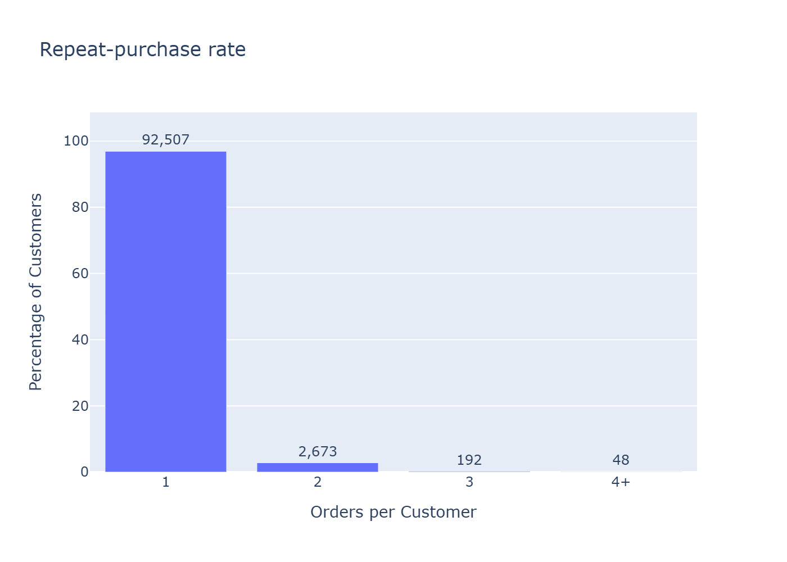
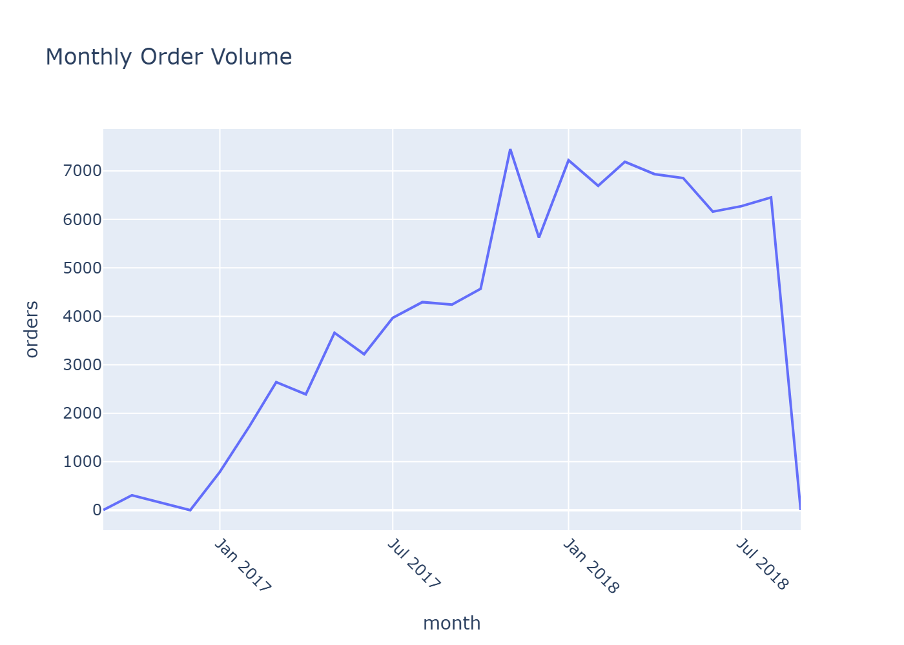
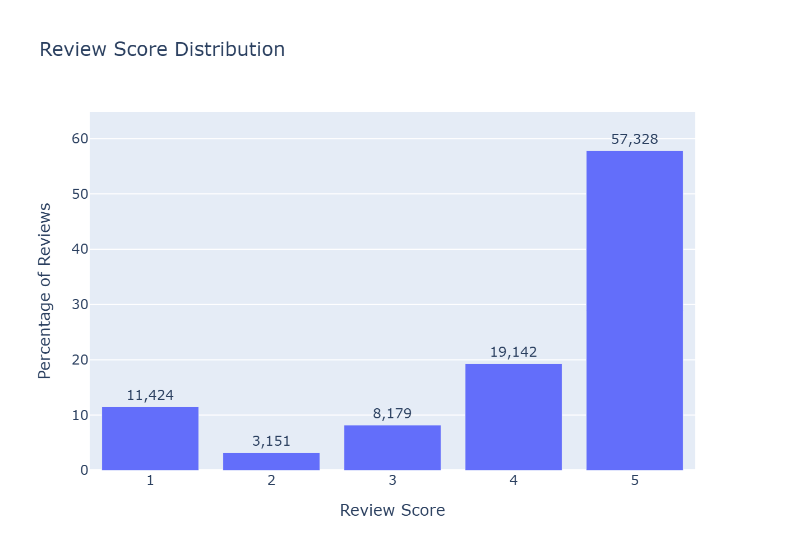
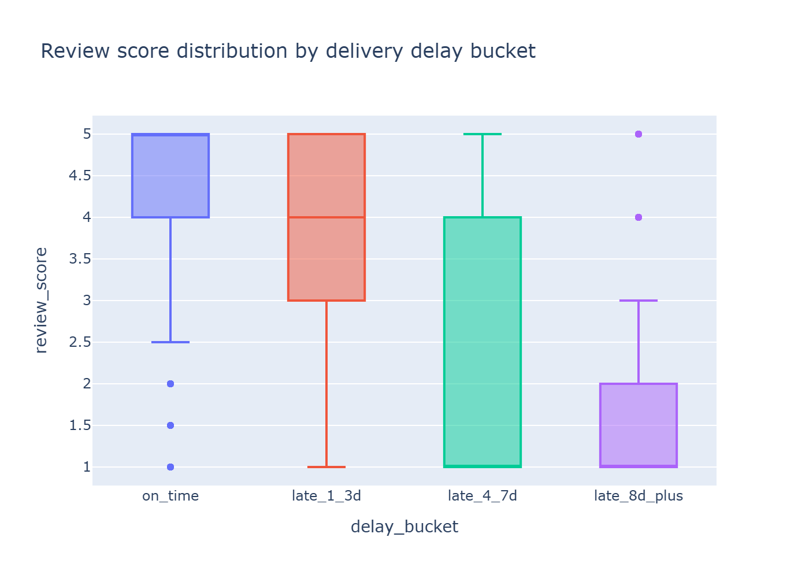

# Olist E-Commerce Customer Analytics

> Customer analytics on 100K+ Brazilian e-commerce orders. RFM segmentation, CLV modeling, churn analysis, NLP sentiment, and geographic decomposition across 9 relational tables, 2016-2018.

<!-- HERO IMAGE: LinkedIn link previews pull the first image. The repeat-purchase chart is the load-bearing finding for the project, so it's the hero. -->



100K orders across 9 relational tables. **96.9% of customers buy once and never come back.** That one number drives most of the project's design choices. Delivery time correlates only weakly with reviews (Spearman ρ = -0.23, weaker than the literature predicts).

## TL;DR

- Olist is a one-shot marketplace. 96.9% of customers buy once and never come back.
- Reviews polarize hard: 57.8% are 5-star, 11.5% are 1-star, and the 2- and 3-star middle is thinner than either tail.
- Late delivery doesn't explain that 1-star tail. Only 6.8% of orders arrive late, and the Spearman correlation between delivery time and review score sits at -0.23. That's not enough to do the work.

---

## Findings by phase

### Phase 1: Exploratory Data Analysis

Phase 1 was about pinning down the marketplace's shape before any deeper modeling. 96.9% of customers buy exactly once over the two-year window. That kills classical RFM segmentation on the Frequency axis: when almost everyone has Frequency = 1, the quintile scoring scheme collapses into a single bucket, so Phase 5 will instead split one-timers from repeaters and cluster the 2,913 repeaters separately. Reviews are bimodal: 57.8% are 5-star and 11.5% are 1-star, with the 1-star bar taller than 2- and 3-star combined. Delivery is fine; the median order arrives 12 days early and only 6.8% miss the estimate. So lateness isn't the explanation for that 1-star tail. The Spearman correlation between delivery time and review score is just -0.23, far too weak to carry it. Phase 8 will need to read the Portuguese review text to find what is.

#### Charts

| Monthly order volume | Repeat-purchase rate | Review score distribution |
|---|---|---|
|  |  |  |

Delivery delay distribution and the correlation heatmap are in the [Phase 1 notebook](notebooks/01_eda.ipynb) (linked rather than embedded to keep the README focused on hero charts).

### Phase 2: Delivery Performance Analysis

Phase 2 quantified the delivery-vs-review story Phase 1 only hinted at. Late orders are 5.78x more likely to receive 1-2 stars (52.8% vs 9.1% one-star rate), and the bucketed Kruskal-Wallis test confirms the pattern is real and ordered (epsilon-squared = 0.106, all 6 pairwise comparisons significant after Bonferroni). But lateness explains only 33.8% of all 1-2 star reviews; the remaining two-thirds come from on-time orders where product quality, communication, or other non-delivery factors must be doing the work. Geographic spread is wide: SP delivers in 7.2 days (94.1% on-time) while AM takes 25.9 days but still hits 95.9% on-time because Olist sets very long Amazon estimates; AL is the genuine outlier, slow AND missing estimates (22.3 days, 76.1% on-time). Phase 8 will read the Portuguese review text to find what drives the on-time tail.

#### Charts



State-level delivery comparison and the 4-panel lifecycle subplot are in the [Phase 2 notebook](notebooks/02_delivery.ipynb).
<!-- Phase 3: Product & Category Analysis (in progress) -->
<!-- Phase 4: Seller Performance Scoring (in progress) -->
<!-- Phase 5: Customer Segmentation - RFM (in progress) -->
<!-- Phase 6: Customer Lifetime Value (in progress) -->
<!-- Phase 7: Churn / Retention Analysis (in progress) -->
<!-- Phase 8: Review Sentiment Analysis (in progress) -->
<!-- Phase 9: Geographic & Spatial Analysis (in progress) -->
<!-- Phase 9.5: Marketing Funnel Integration (in progress) -->
<!-- Phase 10: Final Deliverable & Portfolio (in progress) -->

---

## Methodology

### Dataset

The [Brazilian E-Commerce Public Dataset by Olist](https://www.kaggle.com/datasets/olistbr/brazilian-ecommerce/data) released by Olist on Kaggle. Nine interconnected CSV files covering 100K+ real orders placed between 2016-09 and 2018-10 across the Olist marketplace.

| Table | Rows | Role |
|---|---|---|
| customers | 99K | Customer-to-order links (`customer_unique_id` tracks people; `customer_id` is per-order) |
| orders | 99K | Order lifecycle with five timestamp columns (purchase, approval, carrier, delivery, estimated) |
| order_items | 112K | Line items per order; multi-item orders span multiple sellers |
| order_payments | 103K | Payment method, installments, value |
| order_reviews | 104K | Review score (1-5) and Portuguese-language comments |
| products | 32K | Category (Portuguese), weight, dimensions |
| sellers | 3K | Seller geography |
| geolocation | 1M | Zip-prefix to lat/lng (deduplicated to ~19K prefixes for joining) |
| category_translation | 70 | Portuguese to English category names |

### Tech stack

| Layer | Tool |
|---|---|
| SQL joins across 9 tables | DuckDB |
| Notebook environment | Jupyter (paired with `.py:percent` twins via jupytext for git-friendly diffs) |
| DataFrame manipulation | pandas |
| Interactive visualization | Plotly |
| Statistical analysis | scipy, statsmodels |
| ML / clustering / explainability | scikit-learn, lifetimes, SHAP |
| NLP | sentence-transformers (multilingual), scikit-learn (TF-IDF + NMF) |
| Geospatial | geopandas, Plotly choropleth |

### Reproducibility

```bash
# 1. Clone the repo
git clone <repo-url>
cd "E-Commerce Customer Analytics (Olist Brazilian E-Commerce)"

# 2. Install dependencies
pip install -r requirements.txt

# 3. Download the dataset from Kaggle and place CSVs in data/
# https://www.kaggle.com/datasets/olistbr/brazilian-ecommerce

# 4. Set up jupytext + nbstripout (one-time per clone)
nbstripout --install

# 5. Run notebooks in order
jupyter lab notebooks/00_data_loading.ipynb  # builds parquet checkpoints
jupyter lab notebooks/01_eda.ipynb            # Phase 1 EDA
# ... subsequent phase notebooks as they ship
```

For each notebook, use **Kernel → Restart Kernel and Run All Cells** to ensure clean state.

---

## Repository structure

<details>
<summary>Click to expand the project tree</summary>

```
E-Commerce Customer Analytics (Olist Brazilian E-Commerce)/
├── README.md                       <-- This file
├── requirements.txt                <-- Pinned Python dependencies
├── .gitattributes                  <-- LF line endings, nbstripout filter mapping
├── .gitignore                      <-- Excludes data files, parquet checkpoints, local context
├── jupytext.toml                   <-- Pairs .ipynb with .py:percent for git diffs
├── data/                           <-- 9 CSVs from Kaggle (gitignored; see Reproducibility)
├── notebooks/
│   ├── 00_data_loading.ipynb      <-- DuckDB joins to build the master DataFrame + parquet checkpoints
│   ├── 01_eda.ipynb               <-- Phase 1: EDA, hero charts, marketplace overview
│   └── (subsequent phase notebooks ship as Phases 2-10 close)
├── assets/
│   └── readme/                    <-- Hero PNGs embedded in this README
└── exports/                        <-- HTML notebook exports for Phase 10 portfolio package
```

</details>

---

## About

**Author**: Gustavo

**Contact**: [LinkedIn](https://www.linkedin.com/in/gustavo-salerno) · gustavogs2002@gmail.com

This project is part of a portfolio of data-analytics work. Each phase ships as its own notebook with documented findings, hero charts in the gallery above, and decisions logged for traceability.
